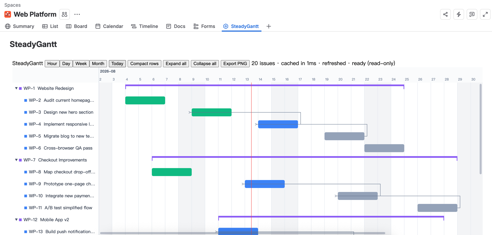
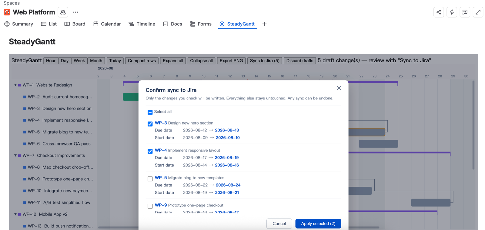

# SteadyGantt — Gantt chart for Jira with safe rescheduling

The Gantt chart that never touches your Jira data without asking.

Too many timeline apps rewrite dates on install, sync changes you never meant to make, or lose
your work to a missing save button. SteadyGantt is built around one rule: **Jira stays untouched
until you confirm a diff.**

**[▶ Try the live demo](https://leo-liu-522.github.io/steadygantt/demo/)** — the full app with
sample data, right in your browser. No install, no signup.

## The safety model

1. **Read-only by default.** Open it, explore, zoom — nothing is written.
2. **Drafts first.** Every drag is a draft, shown next to a ghost of the original.
3. **Exact diff.** Review old → new for every change, apply only what you check.
4. **One-click undo.** Any sync can be reversed to the previous values instantly.

Also in the box: full hierarchy and dependencies, hour-to-month zoom, canvas rendering that stays
fast at thousands of issues, views that restore themselves, PNG export. Built on Atlassian Forge —
no external servers, no trackers, your data never leaves Atlassian.

## Links

- [Product page](https://leo-liu-522.github.io/steadygantt/)
- [Live demo](https://leo-liu-522.github.io/steadygantt/demo/)
- [Jira Gantt apps compared, with live Marketplace data](https://leo-liu-522.github.io/steadygantt/compare/jira-gantt-chart-apps.html)
- [The Jira Gantt app data-safety checklist](https://leo-liu-522.github.io/steadygantt/guides/jira-gantt-data-safety-checklist.html) — 10 tests to run in any Gantt trial, tool-agnostic
- [Privacy](https://leo-liu-522.github.io/steadygantt/privacy.html) · [Security](https://leo-liu-522.github.io/steadygantt/security.html)

## Support

Questions answered within 24 hours: **steadygantt@outlook.com**

*This repository hosts the SteadyGantt product site and live demo (GitHub Pages).*
